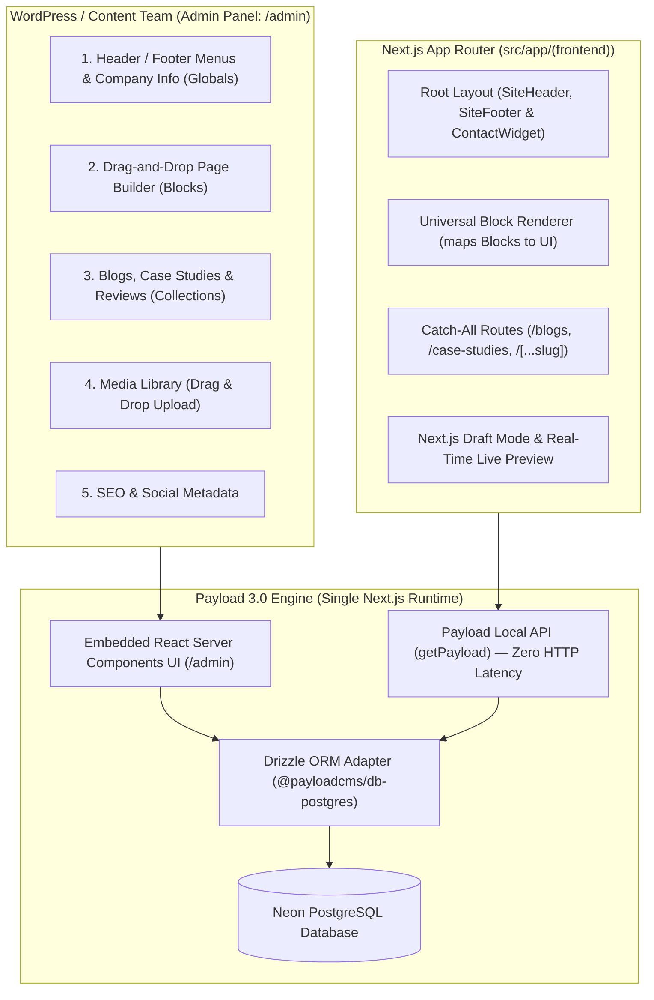

# Dynamic Dreamz 100% Full-Site Payload CMS Integration & Operations Guide

This guide details the complete architecture, data models, frontend integration, and non-technical operational manual for managing **100% of website content, pages, media, and navigation** via **[Payload CMS 3.0](https://payloadcms.com/)** embedded natively in Next.js.

No code edits, developer intervention, or Git commits are required for WordPress/content team members to:
- Edit the Header dropdowns, Footer navigation columns, and bottom legal links.
- Update company phone numbers, WhatsApp, emails, and global office addresses.
- Build and edit any Landing, Service, or Industry page using a **Drag-and-Drop Modular Page Builder**.
- Add, update, and publish Blog Articles and Case Studies.
- Upload, replace, and organize images in the Media Library with automated WebP conversion and SEO alt attributes.
- Update SEO metadata (Meta Titles, Descriptions, Canonical URLs, and OG Images) on any page.

---

## 1. Architectural Overview: Next.js Native Payload 3.0

Unlike Strapi (which ran as an external service requiring a separate port, process, and REST/GraphQL HTTP overhead), **Payload 3.0 runs directly inside Next.js App Router**:



### Key Technical Advantages of this Architecture
1. **Single Deployment**: Only one Next.js application to deploy (e.g., Vercel, Node server, Docker). No separate CMS backend or proxy server.
2. **Zero HTTP Latency**: Next.js Server Components query database records directly in-process via `getPayload({ config })` without HTTP requests or bearer token authentication.
3. **End-to-End TypeScript**: Types are auto-generated from collection definitions directly into `src/types/payload-types.ts`.
4. **App Router Route Group Isolation**:
   - `src/app/(frontend)/`: Contains all marketing pages, layouts, styles, and font files.
   - `src/app/(payload)/`: Contains the isolated Payload Admin Panel and REST/GraphQL routes.

---

## 2. WordPress Team Translation Matrix

For team members transitioning from WordPress, this table maps legacy WordPress features directly to Payload CMS:

| WordPress Concept | Payload CMS Equivalent | How the Content Team Operates It |
| :--- | :--- | :--- |
| **Appearance $\rightarrow$ Menus** | **Globals $\rightarrow$ Navigation** | Visually add, rename, and reorder header dropdowns, footer columns, and bottom links. |
| **Theme Customizer / Options** | **Globals $\rightarrow$ Site Settings** | Update phone numbers, WhatsApp, contact email, office addresses, and social links. |
| **Elementor / Gutenberg** | **Collections $\rightarrow$ Pages (Blocks)** | Click **"Add Section"** to insert visual blocks (`Hero`, `FAQs`, `Stat Counters`, `Feature Grid`, `CTA Banner`). Reorder by dragging. |
| **Posts & Categories** | **Collections $\rightarrow$ Articles & Categories** | Write posts using the Lexical Rich Text editor, attach categories, author, FAQs, and custom excerpts. |
| **Custom Post Types (Portfolio)** | **Collections $\rightarrow$ Case Studies** | Manage client names, metrics, problem/solution copy, image galleries, and client review quotes. |
| **Reviews / Testimonials** | **Collections $\rightarrow$ Testimonials** | Add client reviews, star ratings, roles, and company logos. |
| **Media Library** | **Collections $\rightarrow$ Media** | Drag-and-drop file uploads with automatic image resizing, focal points, and mandatory alt text. |
| **Yoast / RankMath SEO** | **SEO Field Group (Built-in)** | Edit Meta Title, Meta Description, Canonical URL, and Social Share Image for any page or post. |

---

## 3. Master Directory & File Map

```text
/home/ubuntu/Vatsal/DD/dynamicdreamz-self/
├── payload.config.ts                     # Master Payload configuration
├── src/
│   ├── app/
│   │   ├── (frontend)/                   # All public website pages & layouts
│   │   │   ├── layout.tsx                # Frontend Root Layout
│   │   │   ├── [...slug]/page.tsx        # Dynamic modular page builder route
│   │   │   ├── blogs/                    # Blog archive & detail routes
│   │   │   └── case-studies/             # Case studies archive & detail routes
│   │   └── (payload)/                    # Isolated Payload Admin & API routes
│   │       ├── admin/[[...segments]]/    # Admin panel dashboard pages
│   │       ├── api/[...slug]/            # REST API endpoints
│   │       ├── api/graphql/              # GraphQL API endpoint
│   │       └── layout.tsx                # Admin layout with Payload styling
│   ├── collections/                      # Content Collections
│   │   ├── Users.ts                      # Admin & Editor user accounts
│   │   ├── Media.ts                      # Uploaded images, icons, and banners
│   │   ├── Articles.ts                   # Blog posts
│   │   ├── Categories.ts                 # Blog categories
│   │   ├── Authors.ts                    # Blog authors
│   │   ├── CaseStudies.ts                # Portfolio case studies
│   │   ├── Testimonials.ts               # Client testimonials & reviews
│   │   └── Pages.ts                      # Modular pages with Blocks field
│   ├── globals/                          # Site-Wide Globals
│   │   ├── Navigation.ts                 # Header & footer menus
│   │   └── SiteSettings.ts               # Contact details, address, and social links
│   ├── blocks/                           # Drag-and-drop section schemas
│   │   ├── HeroBlock.ts                  # Hero banner schema
│   │   ├── ProofCountersBlock.ts         # Metric counters schema
│   │   ├── FeaturesGridBlock.ts          # Feature grid schema
│   │   ├── ProcessTimelineBlock.ts       # Development process roadmap schema
│   │   ├── FaqAccordionBlock.ts          # FAQ accordion schema
│   │   ├── HappyClientsBlock.ts          # Reviews carousel schema
│   │   └── CtaBannerBlock.ts             # CTA banner schema
│   ├── components/blocks/
│   │   └── block-renderer.tsx            # Universal block renderer (maps CMS blocks to UI)
│   ├── lib/
│   │   └── payload.ts                    # Typed Local API fetch helper functions
│   └── types/
│       └── payload-types.ts              # Auto-generated TypeScript interfaces
```

---

## 4. Phase-by-Phase Implementation Roadmap

### Phase 1: Define Collections & Globals

#### 1. Site Settings Global (`src/globals/SiteSettings.ts`)
Allows editors to change company contact information across the site instantly:
```ts
import type { GlobalConfig } from "payload";

export const SiteSettings: GlobalConfig = {
  slug: "site-settings",
  label: "Company Information",
  access: {
    read: () => true,
  },
  fields: [
    {
      name: "phone",
      type: "text",
      label: "Phone Number",
      defaultValue: "+91 9327642007",
      required: true,
    },
    {
      name: "whatsappNumber",
      type: "text",
      label: "WhatsApp Number (Digits only, including country code)",
      defaultValue: "919327642007",
      required: true,
    },
    {
      name: "email",
      type: "email",
      label: "Contact Email",
      defaultValue: "info@dynamicdreamz.com",
      required: true,
    },
    {
      name: "skype",
      type: "text",
      label: "Skype ID",
      defaultValue: "live:dynamicdreamz",
    },
    {
      name: "address",
      type: "textarea",
      label: "Office Address",
      defaultValue: "Surat, Gujarat, India",
    },
    {
      name: "socialLinks",
      type: "array",
      label: "Social Media Profiles",
      fields: [
        {
          name: "platform",
          type: "select",
          required: true,
          options: [
            { label: "LinkedIn", value: "linkedin" },
            { label: "Twitter / X", value: "twitter" },
            { label: "Facebook", value: "facebook" },
            { label: "Instagram", value: "instagram" },
            { label: "Clutch", value: "clutch" },
          ],
        },
        {
          name: "url",
          type: "text",
          required: true,
        },
      ],
    },
  ],
};
```

#### 2. Navigation Global (`src/globals/Navigation.ts`)
Gives editors full control over Header dropdown menus and Footer link columns:
```ts
import type { GlobalConfig } from "payload";

export const Navigation: GlobalConfig = {
  slug: "navigation",
  label: "Header & Footer Menus",
  access: {
    read: () => true,
  },
  fields: [
    {
      name: "headerNav",
      type: "array",
      label: "Header Navigation Items",
      fields: [
        {
          name: "title",
          type: "text",
          required: true,
        },
        {
          name: "href",
          type: "text",
        },
        {
          name: "isMegaMenu",
          type: "checkbox",
          defaultValue: false,
        },
        {
          name: "subItems",
          type: "array",
          label: "Dropdown Sub-Links",
          fields: [
            { name: "label", type: "text", required: true },
            { name: "href", type: "text", required: true },
            { name: "description", type: "text" },
            { name: "badge", type: "text" },
          ],
        },
      ],
    },
    {
      name: "footerColumns",
      type: "array",
      label: "Footer Navigation Columns",
      fields: [
        {
          name: "title",
          type: "text",
          required: true,
        },
        {
          name: "links",
          type: "array",
          fields: [
            { name: "label", type: "text", required: true },
            { name: "href", type: "text", required: true },
          ],
        },
      ],
    },
    {
      name: "footerBottomLinks",
      type: "array",
      label: "Footer Bottom Legal Links",
      fields: [
        { name: "label", type: "text", required: true },
        { name: "href", type: "text", required: true },
      ],
    },
  ],
};
```

#### 3. Blog Articles Collection (`src/collections/Articles.ts`)
Supports writing posts in Lexical rich text, assigning categories, authors, FAQs, and SEO:
```ts
import type { CollectionConfig } from "payload";

export const Articles: CollectionConfig = {
  slug: "articles",
  admin: {
    useAsTitle: "title",
    defaultColumns: ["title", "slug", "categories", "date", "status"],
  },
  fields: [
    { name: "title", type: "text", required: true },
    { name: "slug", type: "text", required: true, unique: true },
    { name: "date", type: "date", required: true },
    { name: "displayDate", type: "text" },
    { name: "coverImage", type: "upload", relationTo: "media", required: true },
    { name: "excerpt", type: "textarea", required: true },
    { name: "content", type: "richText", required: true },
    {
      name: "categories",
      type: "relationship",
      relationTo: "categories",
      hasMany: true,
    },
    {
      name: "author",
      type: "relationship",
      relationTo: "authors",
    },
    {
      name: "faqs",
      type: "array",
      label: "Article FAQs",
      fields: [
        { name: "question", type: "text", required: true },
        { name: "answer", type: "textarea", required: true },
      ],
    },
    {
      name: "seo",
      type: "group",
      label: "SEO Settings",
      fields: [
        { name: "metaTitle", type: "text" },
        { name: "metaDescription", type: "textarea" },
        { name: "canonicalUrl", type: "text" },
        { name: "metaImage", type: "upload", relationTo: "media" },
      ],
    },
  ],
};
```

#### 4. Case Studies Collection (`src/collections/CaseStudies.ts`)
Manages portfolio proof, client results, and galleries:
```ts
import type { CollectionConfig } from "payload";

export const CaseStudies: CollectionConfig = {
  slug: "case-studies",
  admin: {
    useAsTitle: "title",
    defaultColumns: ["title", "slug", "clientName", "industry"],
  },
  fields: [
    { name: "title", type: "text", required: true },
    { name: "slug", type: "text", required: true, unique: true },
    { name: "clientName", type: "text", required: true },
    { name: "industry", type: "text" },
    { name: "websiteUrl", type: "text" },
    { name: "thumbnail", type: "upload", relationTo: "media", required: true },
    { name: "heroImage", type: "upload", relationTo: "media" },
    { name: "gallery", type: "array", fields: [{ name: "image", type: "upload", relationTo: "media" }] },
    { name: "overview", type: "textarea" },
    { name: "challenge", type: "textarea" },
    { name: "solution", type: "textarea" },
    {
      name: "metrics",
      type: "array",
      label: "Key Results & Metrics",
      fields: [
        { name: "value", type: "text", required: true },
        { name: "label", type: "text", required: true },
      ],
    },
    {
      name: "testimonial",
      type: "relationship",
      relationTo: "testimonials",
    },
    {
      name: "seo",
      type: "group",
      fields: [
        { name: "metaTitle", type: "text" },
        { name: "metaDescription", type: "textarea" },
        { name: "metaImage", type: "upload", relationTo: "media" },
      ],
    },
  ],
};
```

---

### Phase 2: Drag-and-Drop Page Builder (`Pages.ts` & Blocks)

The Page Builder allows non-technical editors to build service, landing, and campaign pages without coding:

```ts
// src/collections/Pages.ts
import type { CollectionConfig } from "payload";
import { HeroBlock } from "@/blocks/HeroBlock";
import { ProofCountersBlock } from "@/blocks/ProofCountersBlock";
import { FeaturesGridBlock } from "@/blocks/FeaturesGridBlock";
import { ProcessTimelineBlock } from "@/blocks/ProcessTimelineBlock";
import { FaqAccordionBlock } from "@/blocks/FaqAccordionBlock";
import { HappyClientsBlock } from "@/blocks/HappyClientsBlock";
import { CtaBannerBlock } from "@/blocks/CtaBannerBlock";

export const Pages: CollectionConfig = {
  slug: "pages",
  admin: {
    useAsTitle: "title",
    defaultColumns: ["title", "slug", "updatedAt"],
  },
  fields: [
    { name: "title", type: "text", required: true },
    { name: "slug", type: "text", required: true, unique: true },
    {
      name: "sections",
      type: "blocks",
      label: "Page Layout Sections (Drag & Drop)",
      blocks: [
        HeroBlock,
        ProofCountersBlock,
        FeaturesGridBlock,
        ProcessTimelineBlock,
        FaqAccordionBlock,
        HappyClientsBlock,
        CtaBannerBlock,
      ],
    },
    {
      name: "seo",
      type: "group",
      fields: [
        { name: "metaTitle", type: "text" },
        { name: "metaDescription", type: "textarea" },
        { name: "canonicalUrl", type: "text" },
        { name: "metaImage", type: "upload", relationTo: "media" },
      ],
    },
  ],
};
```

Each block schema maps 1:1 to your existing section components in [src/components/blocks/block-renderer.tsx](file:///home/ubuntu/Vatsal/DD/dynamicdreamz-self/src/components/blocks/block-renderer.tsx):

- `HeroBlock` $\rightarrow$ `<ServiceHeroSection />`
- `ProofCountersBlock` $\rightarrow$ `<ProofCounterSection />`
- `FeaturesGridBlock` $\rightarrow$ `<FeaturesGridSection />`
- `ProcessTimelineBlock` $\rightarrow$ `<OurDevelopmentProcessSection />`
- `FaqAccordionBlock` $\rightarrow$ `<SplitFaqSection />`
- `HappyClientsBlock` $\rightarrow$ `<HappyClientSection />`
- `CtaBannerBlock` $\rightarrow$ `<CtaBannerSection />`

---

### Phase 3: Data Access Layer via Payload Local API

Create [src/lib/payload.ts](file:///home/ubuntu/Vatsal/DD/dynamicdreamz-self/src/lib/payload.ts) to provide typed helpers for Server Components:

```ts
import { getPayload } from "payload";
import config from "@payload-config";

/**
 * Fetches site-wide navigation (Header dropdowns & Footer columns).
 */
export async function getPayloadNavigation() {
  try {
    const payload = await getPayload({ config });
    return await payload.findGlobal({ slug: "navigation" });
  } catch (err) {
    console.warn("Payload getPayloadNavigation warning:", err);
    return null;
  }
}

/**
 * Fetches company contact information (Phone, WhatsApp, Email, Address).
 */
export async function getPayloadSiteSettings() {
  try {
    const payload = await getPayload({ config });
    return await payload.findGlobal({ slug: "site-settings" });
  } catch (err) {
    console.warn("Payload getPayloadSiteSettings warning:", err);
    return null;
  }
}

/**
 * Fetches all blog articles.
 */
export async function getPayloadArticles(limit = 100) {
  try {
    const payload = await getPayload({ config });
    const res = await payload.find({
      collection: "articles",
      limit,
      sort: "-date",
    });
    return res.docs;
  } catch (err) {
    console.warn("Payload getPayloadArticles warning:", err);
    return [];
  }
}

/**
 * Fetches a modular page by slug.
 */
export async function getPayloadPageBySlug(slug: string) {
  try {
    const payload = await getPayload({ config });
    const res = await payload.find({
      collection: "pages",
      where: {
        slug: { equals: slug },
      },
      limit: 1,
    });
    return res.docs[0] || null;
  } catch (err) {
    console.warn(`Payload getPayloadPageBySlug(${slug}) warning:`, err);
    return null;
  }
}
```

---

### Phase 4: Frontend Layout & Route Connection

#### 1. Root Layout ([src/app/(frontend)/layout.tsx](file:///home/ubuntu/Vatsal/DD/dynamicdreamz-self/src/app/%28frontend%29/layout.tsx))
Passes Payload navigation and site settings directly to `SiteHeader` and `SiteFooter`:

```tsx
import { getPayloadNavigation, getPayloadSiteSettings } from "@/lib/payload";
import { SiteHeader } from "@/components/layout/site-header";
import { SiteFooter } from "@/components/layout/site-footer";
import { ContactWidget } from "@/components/layout/contact-widget";

export default async function RootLayout({ children }: { children: React.ReactNode }) {
  const [navData, settings] = await Promise.all([
    getPayloadNavigation(),
    getPayloadSiteSettings(),
  ]);

  return (
    <html lang="en">
      <body>
        <SiteHeader navigation={navData} />
        {children}
        <SiteFooter navigation={navData} settings={settings} />
        <ContactWidget whatsappNumber={settings?.whatsappNumber} />
      </body>
    </html>
  );
}
```

#### 2. Dynamic Catch-All Route ([src/app/(frontend)/[...slug]/page.tsx](file:///home/ubuntu/Vatsal/DD/dynamicdreamz-self/src/app/%28frontend%29/%5B...slug%5D/page.tsx))
Renders any Payload-managed page with instant SEO:

```tsx
import { notFound } from "next/navigation";
import { getPayloadPageBySlug } from "@/lib/payload";
import { BlockRenderer } from "@/components/blocks/block-renderer";

export default async function DynamicPageRoute({ params }: { params: Promise<{ slug?: string[] }> }) {
  const { slug } = await params;
  const pageSlug = slug && slug.length > 0 ? slug.join("/") : "home";
  const page = await getPayloadPageBySlug(pageSlug);

  if (!page) {
    notFound();
  }

  return (
    <main id="main-content">
      <BlockRenderer sections={page.sections} />
    </main>
  );
}
```

---

### Phase 5: One-Click Migration / Seeding Script

To avoid manual data re-entry, run an automated script (`scripts/seed-payload.mjs`):
1. Reads all **103 local blog post JSON files** from [src/content/blog-posts/posts/](file:///home/ubuntu/Vatsal/DD/dynamicdreamz-self/src/content/blog-posts/posts/).
2. Reads navigation menus from [src/data/navigation.ts](file:///home/ubuntu/Vatsal/DD/dynamicdreamz-self/src/data/navigation.ts).
3. Reads company facts and contact details from [src/data/site.ts](file:///home/ubuntu/Vatsal/DD/dynamicdreamz-self/src/data/site.ts).
4. Populates Payload collections and globals using the Local API in seconds.

---

### Phase 6: User Roles & Governance (RBAC)

In `src/collections/Users.ts`, create two distinct roles:

1. **`Admin`**:
   - Access to database configurations, user account creation, and system settings.
2. **`Editor` (WordPress Team)**:
   - Access restricted to editing content: Articles, Case Studies, Pages, Navigation, Site Settings, and Media.
   - Cannot delete user accounts or modify system architecture.

```ts
// src/collections/Users.ts
import type { CollectionConfig } from "payload";

export const Users: CollectionConfig = {
  slug: "users",
  auth: true,
  admin: {
    useAsTitle: "email",
  },
  fields: [
    {
      name: "role",
      type: "select",
      required: true,
      defaultValue: "editor",
      options: [
        { label: "Administrator", value: "admin" },
        { label: "Content Editor (WP Team)", value: "editor" },
      ],
      access: {
        update: ({ req }) => req.user?.role === "admin",
      },
    },
  ],
};
```

---

## 5. Non-Technical Operations Manual for the Content Team

### 1. Logging Into the Dashboard
- URL: `http://localhost:3000/admin` (or `https://www.dynamicdreamz.com/admin`)
- Enter your email and password.

### 2. Updating Header & Footer Menus
1. Click **Globals** $\rightarrow$ **Header & Footer Menus** in the left sidebar.
2. Under **Header Navigation Items**, click on any menu (e.g. *Shopify*, *Services*, *Hire Developers*).
3. Add or edit links, labels, and descriptions.
4. Click **Save** $\rightarrow$ Changes reflect on the website immediately.

### 3. Creating a New Landing Page with the Page Builder
1. Click **Pages** $\rightarrow$ **Create New**.
2. Enter **Title** (e.g., `Shopify Migration in Sydney`) and **Slug** (`shopify-migration-in-sydney`).
3. Under **Page Layout Sections**, click **Add Section**:
   - Select **Hero** $\rightarrow$ Fill heading, subtitle, button label, and upload a hero image.
   - Select **Proof Counters** $\rightarrow$ Add counters (e.g., `5000+ Projects`).
   - Select **FAQ Accordion** $\rightarrow$ Add questions and answers.
   - Select **CTA Banner** $\rightarrow$ Configure conversion CTA.
4. Reorder sections by clicking the drag handle on the left of any section block.
5. In the **SEO Settings** box, enter the Meta Title and Meta Description.
6. Click **Publish**. The page is live instantly at `/shopify-migration-in-sydney`!

### 4. Publishing a Blog Post
1. Click **Articles** $\rightarrow$ **Create New**.
2. Enter **Title**, select **Date**, and choose or create **Categories**.
3. Upload the **Featured Cover Image** (Payload optimizes it automatically).
4. Write your post in the rich text editor (supports headings, bold, bullet points, blockquotes, and code snippets).
5. Add FAQ items at the bottom of the article if desired.
6. Click **Publish**.

### 5. Media Library Guidelines
- Supported formats: `.webp`, `.png`, `.jpg`, `.svg`.
- Every image upload prompts for an **Alt Text** field for SEO accessibility.
- Automatic responsive sizes (thumbnails, desktop, tablet) are generated automatically.

---

## 6. Verification & Quality Standards

Before deploying any CMS configuration:
1. `npm run check:urls` must pass (no trailing slashes).
2. `npm run check:component-content` must pass (content boundaries intact).
3. `npx tsc --noEmit` must pass with 0 type errors.
4. `npm run build` must succeed with exit code 0.
