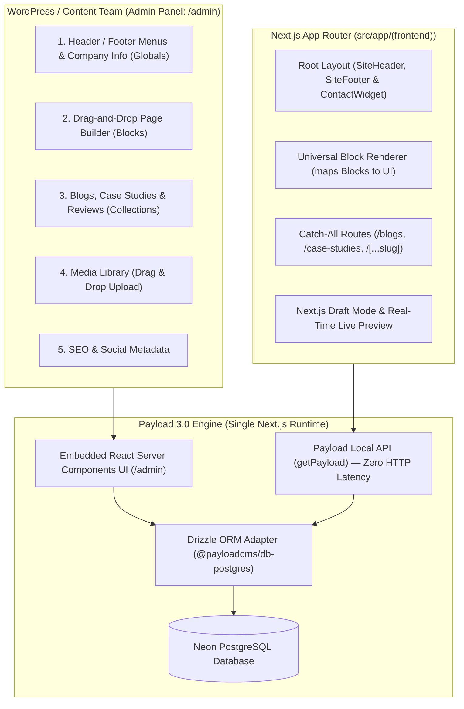

# Dynamic Dreamz 100% Full-Site Payload CMS Integration & Operations Guide

This guide details the complete architecture, data models, frontend integration, automated seeding, and non-technical operational manual for managing **100% of website content, pages, media, and navigation** via **[Payload CMS 3.0](https://payloadcms.com/)** embedded natively in Next.js.

No code edits, developer intervention, or Git commits are required for WordPress/content team members to:
- Edit the Header dropdowns, Footer navigation columns, and bottom legal links.
- Update company phone numbers, WhatsApp, emails, and global office addresses.
- Build and edit any Landing, Service, or Industry page using a **Drag-and-Drop Modular Page Builder**.
- Add, update, and publish Blog Articles and Case Studies.
- Upload, replace, and organize images in the Media Library with automated WebP conversion and SEO alt attributes.
- Update SEO metadata (Meta Titles, Descriptions, Canonical URLs, and OG Images) on any page.

---

## One-Prompt Agent Kickoff

Use this prompt to have any AI agent execute any phase of the Payload CMS implementation:

```text
Read AGENTS.md, docs/agent-workflow.md, and docs/payload-cms-integration-guide.md.
Implement <Phase Name or Task> production-ready, following the exact schemas, block models, and verification steps in docs/payload-cms-integration-guide.md.
Verify with `npm run check:urls`, `npm run check:component-content`, `npx tsc --noEmit`, `npm run lint`, and `npm run build`.
```

---

## 1. Architectural Overview: Next.js Native Payload 3.0

Unlike Strapi (which ran as an external service requiring a separate port, process, and REST/GraphQL HTTP overhead), **Payload 3.0 runs directly inside Next.js App Router**:



### Key Technical Advantages of this Architecture
1. **Single Deployment**: Only one Next.js application to deploy (e.g., Vercel, Node server, Docker). No separate CMS backend or proxy server.
2. **Zero HTTP Latency**: Next.js Server Components query database records directly in-process via `getPayload({ config })` without HTTP requests or bearer token authentication.
3. **End-to-End TypeScript**: Types are auto-generated from collection definitions directly into `src/types/payload-types.ts`.
4. **App Router Route Group Isolation**:
   - `src/app/(frontend)/`: Contains all marketing pages, layouts, styles, and font files.
   - `src/app/(payload)/`: Contains the isolated Payload Admin Panel and REST/GraphQL routes.

---

## 2. WordPress Team Translation Matrix

For team members transitioning from WordPress, this table maps legacy WordPress features directly to Payload CMS:

| WordPress Concept | Payload CMS Equivalent | How the Content Team Operates It |
| :--- | :--- | :--- |
| **Appearance $\rightarrow$ Menus** | **Globals $\rightarrow$ Navigation** | Visually add, rename, and reorder header dropdowns, footer columns, and bottom links. |
| **Theme Customizer / Options** | **Globals $\rightarrow$ Site Settings** | Update phone numbers, WhatsApp, contact email, office addresses, and social links. |
| **Elementor / Gutenberg** | **Collections $\rightarrow$ Pages (Blocks)** | Click **"Add Section"** to insert visual blocks (`Hero`, `FAQs`, `Stat Counters`, `Feature Grid`, `CTA Banner`). Reorder by dragging. |
| **Posts & Categories** | **Collections $\rightarrow$ Articles & Categories** | Write posts using the Lexical Rich Text editor, attach categories, author, FAQs, and custom excerpts. |
| **Custom Post Types (Portfolio)** | **Collections $\rightarrow$ Case Studies** | Manage client names, metrics, problem/solution copy, image galleries, and client review quotes. |
| **Reviews / Testimonials** | **Collections $\rightarrow$ Testimonials** | Add client reviews, star ratings, roles, and company logos. |
| **Media Library** | **Collections $\rightarrow$ Media** | Drag-and-drop file uploads with automatic image resizing, focal points, and mandatory alt text. |
| **Yoast / RankMath SEO** | **SEO Field Group (Built-in)** | Edit Meta Title, Meta Description, Canonical URL, and Social Share Image for any page or post. |

---

## 3. Master Directory & File Map

```text
/home/ubuntu/Vatsal/DD/dynamicdreamz-self/
├── payload.config.ts                     # Master Payload configuration
├── src/
│   ├── app/
│   │   ├── (frontend)/                   # All public website pages & layouts
│   │   │   ├── layout.tsx                # Frontend Root Layout
│   │   │   ├── [...slug]/page.tsx        # Dynamic modular page builder route
│   │   │   ├── blogs/                    # Blog archive & detail routes
│   │   │   └── case-studies/             # Case studies archive & detail routes
│   │   └── (payload)/                    # Isolated Payload Admin & API routes
│   │       ├── admin/[[...segments]]/    # Admin panel dashboard pages
│   │       ├── api/[...slug]/            # REST API endpoints
│   │       ├── api/graphql/              # GraphQL API endpoint
│   │       └── layout.tsx                # Admin layout with Payload styling
│   ├── collections/                      # Content Collections
│   │   ├── Users.ts                      # Admin & Editor user accounts
│   │   ├── Media.ts                      # Uploaded images, icons, and banners
│   │   ├── Articles.ts                   # Blog posts
│   │   ├── Categories.ts                 # Blog categories
│   │   ├── Authors.ts                    # Blog authors
│   │   ├── CaseStudies.ts                # Portfolio case studies
│   │   ├── Testimonials.ts               # Client testimonials & reviews
│   │   └── Pages.ts                      # Modular pages with Blocks field
│   ├── globals/                          # Site-Wide Globals
│   │   ├── Navigation.ts                 # Header & footer menus
│   │   └── SiteSettings.ts               # Contact details, address, and social links
│   ├── blocks/                           # Drag-and-drop section schemas
│   │   ├── HeroBlock.ts                  # Hero banner schema
│   │   ├── ProofCountersBlock.ts         # Metric counters schema
│   │   ├── FeaturesGridBlock.ts          # Feature grid schema
│   │   ├── ProcessTimelineBlock.ts       # Development process roadmap schema
│   │   ├── FaqAccordionBlock.ts          # FAQ accordion schema
│   │   ├── HappyClientsBlock.ts          # Reviews carousel schema
│   │   ├── CaseStudiesBlock.ts           # Case studies grid schema
│   │   └── CtaBannerBlock.ts             # CTA banner schema
│   ├── components/blocks/
│   │   └── block-renderer.tsx            # Universal block renderer (maps CMS blocks to UI)
│   ├── lib/
│   │   └── payload.ts                    # Typed Local API fetch helper functions
│   └── types/
│       └── payload-types.ts              # Auto-generated TypeScript interfaces
```

---

## 4. Phase-by-Phase Implementation Specifications

### Phase 1: Define Globals (Site-Wide Settings)

#### 1. Site Settings Global (`src/globals/SiteSettings.ts`)
```ts
import type { GlobalConfig } from "payload";

export const SiteSettings: GlobalConfig = {
  slug: "site-settings",
  label: "Company Information",
  access: {
    read: () => true,
  },
  fields: [
    {
      name: "phone",
      type: "text",
      label: "Phone Number",
      defaultValue: "+91 9327642007",
      required: true,
    },
    {
      name: "whatsappNumber",
      type: "text",
      label: "WhatsApp Number (Digits only, e.g. 919327642007)",
      defaultValue: "919327642007",
      required: true,
    },
    {
      name: "email",
      type: "email",
      label: "Contact Email",
      defaultValue: "info@dynamicdreamz.com",
      required: true,
    },
    {
      name: "skype",
      type: "text",
      label: "Skype ID",
      defaultValue: "live:dynamicdreamz",
    },
    {
      name: "address",
      type: "textarea",
      label: "Headquarters Address",
      defaultValue: "Surat, Gujarat, India",
    },
    {
      name: "socialLinks",
      type: "array",
      label: "Social Media Links",
      fields: [
        {
          name: "platform",
          type: "select",
          required: true,
          options: [
            { label: "LinkedIn", value: "linkedin" },
            { label: "Twitter / X", value: "twitter" },
            { label: "Facebook", value: "facebook" },
            { label: "Instagram", value: "instagram" },
            { label: "Clutch", value: "clutch" },
          ],
        },
        {
          name: "url",
          type: "text",
          required: true,
        },
      ],
    },
  ],
};
```

#### 2. Navigation Global (`src/globals/Navigation.ts`)
```ts
import type { GlobalConfig } from "payload";

export const Navigation: GlobalConfig = {
  slug: "navigation",
  label: "Header & Footer Menus",
  access: {
    read: () => true,
  },
  fields: [
    {
      name: "headerNav",
      type: "array",
      label: "Header Navigation Items",
      fields: [
        {
          name: "title",
          type: "text",
          required: true,
        },
        {
          name: "href",
          type: "text",
        },
        {
          name: "subItems",
          type: "array",
          label: "Dropdown Sub-Links",
          fields: [
            { name: "label", type: "text", required: true },
            { name: "href", type: "text", required: true },
            { name: "description", type: "text" },
            { name: "badge", type: "text" },
          ],
        },
      ],
    },
    {
      name: "footerColumns",
      type: "array",
      label: "Footer Navigation Columns",
      fields: [
        {
          name: "title",
          type: "text",
          required: true,
        },
        {
          name: "links",
          type: "array",
          fields: [
            { name: "label", type: "text", required: true },
            { name: "href", type: "text", required: true },
          ],
        },
      ],
    },
    {
      name: "footerBottomLinks",
      type: "array",
      label: "Footer Bottom Legal Links",
      fields: [
        { name: "label", type: "text", required: true },
        { name: "href", type: "text", required: true },
      ],
    },
  ],
};
```

---

### Phase 2: Define Core Collections

#### 1. Media Collection (`src/collections/Media.ts`)
```ts
import type { CollectionConfig } from "payload";

export const Media: CollectionConfig = {
  slug: "media",
  access: {
    read: () => true,
  },
  upload: {
    staticDir: "public/uploads",
    imageSizes: [
      {
        name: "thumbnail",
        width: 400,
        height: 300,
        position: "centre",
      },
      {
        name: "card",
        width: 768,
        height: 512,
        position: "centre",
      },
      {
        name: "hero",
        width: 1920,
        height: 1080,
        position: "centre",
      },
    ],
    adminThumbnail: "thumbnail",
    mimeTypes: ["image/*"],
  },
  fields: [
    {
      name: "alt",
      type: "text",
      required: true,
      label: "Alt Text (Required for SEO & Accessibility)",
    },
  ],
};
```

#### 2. Categories Collection (`src/collections/Categories.ts`)
```ts
import type { CollectionConfig } from "payload";

export const Categories: CollectionConfig = {
  slug: "categories",
  admin: {
    useAsTitle: "name",
  },
  access: {
    read: () => true,
  },
  fields: [
    { name: "name", type: "text", required: true },
    { name: "slug", type: "text", required: true, unique: true },
    { name: "description", type: "textarea" },
  ],
};
```

#### 3. Authors Collection (`src/collections/Authors.ts`)
```ts
import type { CollectionConfig } from "payload";

export const Authors: CollectionConfig = {
  slug: "authors",
  admin: {
    useAsTitle: "name",
  },
  access: {
    read: () => true,
  },
  fields: [
    { name: "name", type: "text", required: true },
    { name: "role", type: "text" },
    { name: "avatar", type: "upload", relationTo: "media" },
    { name: "linkedin", type: "text" },
    { name: "bio", type: "textarea" },
  ],
};
```

#### 4. Testimonials Collection (`src/collections/Testimonials.ts`)
```ts
import type { CollectionConfig } from "payload";

export const Testimonials: CollectionConfig = {
  slug: "testimonials",
  admin: {
    useAsTitle: "clientName",
  },
  access: {
    read: () => true,
  },
  fields: [
    { name: "clientName", type: "text", required: true },
    { name: "role", type: "text" },
    { name: "company", type: "text", required: true },
    { name: "content", type: "textarea", required: true },
    { name: "rating", type: "number", defaultValue: 5 },
    { name: "avatar", type: "upload", relationTo: "media" },
    { name: "companyLogo", type: "upload", relationTo: "media" },
    { name: "videoUrl", type: "text" },
  ],
};
```

#### 5. Blog Articles Collection (`src/collections/Articles.ts`)
```ts
import type { CollectionConfig } from "payload";

export const Articles: CollectionConfig = {
  slug: "articles",
  admin: {
    useAsTitle: "title",
    defaultColumns: ["title", "slug", "categories", "date"],
  },
  access: {
    read: () => true,
  },
  fields: [
    { name: "title", type: "text", required: true },
    { name: "slug", type: "text", required: true, unique: true },
    { name: "date", type: "date", required: true },
    { name: "displayDate", type: "text" },
    { name: "coverImage", type: "upload", relationTo: "media", required: true },
    { name: "excerpt", type: "textarea", required: true },
    { name: "content", type: "richText", required: true },
    {
      name: "categories",
      type: "relationship",
      relationTo: "categories",
      hasMany: true,
    },
    {
      name: "author",
      type: "relationship",
      relationTo: "authors",
    },
    {
      name: "faqs",
      type: "array",
      label: "Article FAQs",
      fields: [
        { name: "question", type: "text", required: true },
        { name: "answer", type: "textarea", required: true },
      ],
    },
    {
      name: "seo",
      type: "group",
      label: "SEO Settings",
      fields: [
        { name: "metaTitle", type: "text" },
        { name: "metaDescription", type: "textarea" },
        { name: "canonicalUrl", type: "text" },
        { name: "metaImage", type: "upload", relationTo: "media" },
      ],
    },
  ],
};
```

#### 6. Case Studies Collection (`src/collections/CaseStudies.ts`)
```ts
import type { CollectionConfig } from "payload";

export const CaseStudies: CollectionConfig = {
  slug: "case-studies",
  admin: {
    useAsTitle: "title",
    defaultColumns: ["title", "slug", "clientName", "industry"],
  },
  access: {
    read: () => true,
  },
  fields: [
    { name: "title", type: "text", required: true },
    { name: "slug", type: "text", required: true, unique: true },
    { name: "clientName", type: "text", required: true },
    { name: "industry", type: "text" },
    { name: "technology", type: "text", defaultValue: "Shopify Plus" },
    { name: "websiteUrl", type: "text" },
    { name: "thumbnail", type: "upload", relationTo: "media", required: true },
    { name: "heroImage", type: "upload", relationTo: "media" },
    {
      name: "gallery",
      type: "array",
      fields: [{ name: "image", type: "upload", relationTo: "media" }],
    },
    { name: "overview", type: "textarea" },
    { name: "challenge", type: "textarea" },
    { name: "solution", type: "textarea" },
    {
      name: "metrics",
      type: "array",
      label: "Key Results & Metrics",
      fields: [
        { name: "value", type: "text", required: true },
        { name: "label", type: "text", required: true },
      ],
    },
    {
      name: "testimonial",
      type: "relationship",
      relationTo: "testimonials",
    },
    {
      name: "seo",
      type: "group",
      fields: [
        { name: "metaTitle", type: "text" },
        { name: "metaDescription", type: "textarea" },
        { name: "metaImage", type: "upload", relationTo: "media" },
      ],
    },
  ],
};
```

---

### Phase 3: Define Page Builder Blocks (`src/blocks/`)

These schemas map directly to your existing production UI sections in [src/components/blocks/block-renderer.tsx](file:///home/ubuntu/Vatsal/DD/dynamicdreamz-self/src/components/blocks/block-renderer.tsx).

#### 1. Hero Block (`src/blocks/HeroBlock.ts`)
```ts
import type { Block } from "payload";

export const HeroBlock: Block = {
  slug: "hero",
  labels: { singular: "Hero Section", plural: "Hero Sections" },
  fields: [
    { name: "title", type: "text", required: true },
    { name: "subheading", type: "text" },
    { name: "description", type: "textarea" },
    { name: "ctaLabel", type: "text" },
    { name: "ctaHref", type: "text" },
    { name: "eyebrows", type: "array", fields: [{ name: "text", type: "text" }] },
    { name: "image", type: "upload", relationTo: "media" },
    { name: "showReviews", type: "checkbox", defaultValue: true },
    {
      name: "variant",
      type: "select",
      defaultValue: "split",
      options: [
        { label: "Split (Text + Image)", value: "split" },
        { label: "Centered", value: "centered" },
      ],
    },
  ],
};
```

#### 2. Proof Counters Block (`src/blocks/ProofCountersBlock.ts`)
```ts
import type { Block } from "payload";

export const ProofCountersBlock: Block = {
  slug: "proof-counters",
  labels: { singular: "Proof Counters", plural: "Proof Counters" },
  fields: [
    { name: "heading", type: "text", required: true },
    { name: "description", type: "textarea" },
    {
      name: "counters",
      type: "array",
      fields: [
        { name: "value", type: "number", required: true },
        { name: "suffix", type: "text" },
        { name: "label", type: "text", required: true },
      ],
    },
  ],
};
```

#### 3. Features Grid Block (`src/blocks/FeaturesGridBlock.ts`)
```ts
import type { Block } from "payload";

export const FeaturesGridBlock: Block = {
  slug: "features-grid",
  labels: { singular: "Features Grid", plural: "Features Grids" },
  fields: [
    { name: "eyebrow", type: "text" },
    { name: "heading", type: "text", required: true },
    { name: "description", type: "textarea" },
    {
      name: "features",
      type: "array",
      fields: [
        { name: "title", type: "text", required: true },
        { name: "description", type: "textarea", required: true },
        { name: "icon", type: "upload", relationTo: "media" },
        { name: "linkText", type: "text" },
        { name: "linkUrl", type: "text" },
      ],
    },
  ],
};
```

#### 4. Process Timeline Block (`src/blocks/ProcessTimelineBlock.ts`)
```ts
import type { Block } from "payload";

export const ProcessTimelineBlock: Block = {
  slug: "process-timeline",
  labels: { singular: "Process Timeline", plural: "Process Timelines" },
  fields: [
    { name: "eyebrow", type: "text" },
    { name: "heading", type: "text", required: true },
    {
      name: "steps",
      type: "array",
      fields: [
        { name: "stepNumber", type: "text" },
        { name: "title", type: "text", required: true },
        { name: "description", type: "textarea" },
      ],
    },
  ],
};
```

#### 5. FAQ Accordion Block (`src/blocks/FaqAccordionBlock.ts`)
```ts
import type { Block } from "payload";

export const FaqAccordionBlock: Block = {
  slug: "faq-accordion",
  labels: { singular: "FAQ Accordion", plural: "FAQ Accordions" },
  fields: [
    { name: "eyebrow", type: "text" },
    { name: "heading", type: "text", required: true },
    { name: "description", type: "textarea" },
    {
      name: "faqs",
      type: "array",
      fields: [
        { name: "question", type: "text", required: true },
        { name: "answer", type: "textarea", required: true },
      ],
    },
  ],
};
```

#### 6. Happy Clients Block (`src/blocks/HappyClientsBlock.ts`)
```ts
import type { Block } from "payload";

export const HappyClientsBlock: Block = {
  slug: "happy-clients",
  labels: { singular: "Happy Clients Reviews", plural: "Happy Clients Reviews" },
  fields: [
    { name: "eyebrow", type: "text" },
    { name: "heading", type: "text", required: true },
    { name: "description", type: "textarea" },
    {
      name: "testimonials",
      type: "relationship",
      relationTo: "testimonials",
      hasMany: true,
    },
  ],
};
```

#### 7. Case Studies Block (`src/blocks/CaseStudiesBlock.ts`)
```ts
import type { Block } from "payload";

export const CaseStudiesBlock: Block = {
  slug: "case-studies-block",
  labels: { singular: "Case Studies Grid", plural: "Case Studies Grids" },
  fields: [
    { name: "eyebrow", type: "text" },
    { name: "heading", type: "text" },
    { name: "description", type: "textarea" },
    {
      name: "caseStudies",
      type: "relationship",
      relationTo: "case-studies",
      hasMany: true,
    },
  ],
};
```

#### 8. CTA Banner Block (`src/blocks/CtaBannerBlock.ts`)
```ts
import type { Block } from "payload";

export const CtaBannerBlock: Block = {
  slug: "cta-banner",
  labels: { singular: "CTA Banner", plural: "CTA Banners" },
  fields: [
    { name: "heading", type: "text", required: true },
    { name: "description", type: "textarea" },
    { name: "btnText", type: "text", required: true },
    { name: "btnUrl", type: "text", required: true },
  ],
};
```

#### 9. Brand Partners & Logo Slider Block (`src/blocks/BrandPartnersBlock.ts`)
```ts
import type { Block } from "payload";

export const BrandPartnersBlock: Block = {
  slug: "brand-partners",
  labels: { singular: "Brand Partners / Logo Slider", plural: "Brand Partners / Logo Sliders" },
  fields: [
    { name: "heading", type: "text" },
    { name: "description", type: "textarea" },
    {
      name: "logos",
      type: "array",
      label: "Partner & Client Logos",
      fields: [
        { name: "name", type: "text", required: true },
        { name: "logo", type: "upload", relationTo: "media", required: true },
        { name: "url", type: "text" },
      ],
    },
    {
      name: "variant",
      type: "select",
      defaultValue: "grid",
      options: [
        { label: "Grid", value: "grid" },
        { label: "Slider / Marquee", value: "slider" },
      ],
    },
  ],
};
```

#### 10. Pricing & Hiring Models Block (`src/blocks/PricingModelsBlock.ts`)
```ts
import type { Block } from "payload";

export const PricingModelsBlock: Block = {
  slug: "pricing-models",
  labels: { singular: "Pricing & Hiring Models", plural: "Pricing & Hiring Models" },
  fields: [
    { name: "eyebrow", type: "text" },
    { name: "heading", type: "text", required: true },
    { name: "description", type: "textarea" },
    {
      name: "models",
      type: "array",
      label: "Engagement / Pricing Tiers",
      fields: [
        { name: "label", type: "text", required: true },
        { name: "badge", type: "text" },
        { name: "price", type: "text", required: true },
        { name: "description", type: "textarea" },
        {
          name: "bullets",
          type: "array",
          fields: [{ name: "text", type: "text", required: true }],
        },
        { name: "ctaLabel", type: "text", required: true },
        { name: "ctaHref", type: "text", required: true },
      ],
    },
  ],
};
```

#### 11. Technologies & Integrations Grid Block (`src/blocks/TechnologiesGridBlock.ts`)
```ts
import type { Block } from "payload";

export const TechnologiesGridBlock: Block = {
  slug: "technologies-grid",
  labels: { singular: "Technologies & Integrations Grid", plural: "Technologies & Integrations Grids" },
  fields: [
    { name: "eyebrow", type: "text" },
    { name: "heading", type: "text", required: true },
    { name: "description", type: "textarea" },
    {
      name: "categories",
      type: "array",
      label: "Technology Categories",
      fields: [
        { name: "category", type: "text", required: true },
        {
          name: "technologies",
          type: "array",
          fields: [
            { name: "name", type: "text", required: true },
            { name: "icon", type: "upload", relationTo: "media" },
          ],
        },
      ],
    },
  ],
};
```

#### 12. Two-Column Image with Text Block (`src/blocks/TwoColImageWithTextBlock.ts`)
```ts
import type { Block } from "payload";

export const TwoColImageWithTextBlock: Block = {
  slug: "image-with-text",
  labels: { singular: "Image with Text (Split Content)", plural: "Image with Text Sections" },
  fields: [
    { name: "heading", type: "text", required: true },
    { name: "description", type: "textarea", required: true },
    { name: "image", type: "upload", relationTo: "media", required: true },
    {
      name: "imagePosition",
      type: "select",
      defaultValue: "left",
      options: [
        { label: "Image on Left", value: "left" },
        { label: "Image on Right", value: "right" },
      ],
    },
    {
      name: "bullets",
      type: "array",
      label: "Feature Checklist",
      fields: [{ name: "text", type: "text", required: true }],
    },
    { name: "ctaLabel", type: "text" },
    { name: "ctaHref", type: "text" },
  ],
};
```

#### 13. Industries Served Grid Block (`src/blocks/IndustriesGridBlock.ts`)
```ts
import type { Block } from "payload";

export const IndustriesGridBlock: Block = {
  slug: "industries-grid",
  labels: { singular: "Industries Served Grid", plural: "Industries Served Grids" },
  fields: [
    { name: "eyebrow", type: "text" },
    { name: "heading", type: "text", required: true },
    { name: "description", type: "textarea" },
    {
      name: "industries",
      type: "array",
      label: "Industry Cards",
      fields: [
        { name: "title", type: "text", required: true },
        { name: "eyebrow", type: "text" },
        { name: "description", type: "textarea" },
        { name: "image", type: "upload", relationTo: "media", required: true },
        { name: "href", type: "text" },
      ],
    },
    {
      name: "variant",
      type: "select",
      defaultValue: "grid",
      options: [
        { label: "Grid", value: "grid" },
        { label: "Carousel / Drag Scroll", value: "carousel" },
      ],
    },
  ],
};
```

#### 14. Rich Text Content / Legal Block (`src/blocks/RichTextBlock.ts`)
```ts
import type { Block } from "payload";

export const RichTextBlock: Block = {
  slug: "rich-text-content",
  labels: { singular: "Rich Text Content / Legal", plural: "Rich Text Content Sections" },
  fields: [
    { name: "heading", type: "text" },
    { name: "eyebrow", type: "text" },
    { name: "content", type: "richText", required: true },
    {
      name: "containerWidth",
      type: "select",
      defaultValue: "standard",
      options: [
        { label: "Narrow (Editorial / Legal)", value: "narrow" },
        { label: "Standard", value: "standard" },
        { label: "Full Width", value: "full" },
      ],
    },
  ],
};
```

#### 15. Modular Pages Collection (`src/collections/Pages.ts`)
```ts
import type { CollectionConfig } from "payload";
import { HeroBlock } from "@/blocks/HeroBlock";
import { ProofCountersBlock } from "@/blocks/ProofCountersBlock";
import { FeaturesGridBlock } from "@/blocks/FeaturesGridBlock";
import { ProcessTimelineBlock } from "@/blocks/ProcessTimelineBlock";
import { FaqAccordionBlock } from "@/blocks/FaqAccordionBlock";
import { HappyClientsBlock } from "@/blocks/HappyClientsBlock";
import { CaseStudiesBlock } from "@/blocks/CaseStudiesBlock";
import { CtaBannerBlock } from "@/blocks/CtaBannerBlock";
import { BrandPartnersBlock } from "@/blocks/BrandPartnersBlock";
import { PricingModelsBlock } from "@/blocks/PricingModelsBlock";
import { TechnologiesGridBlock } from "@/blocks/TechnologiesGridBlock";
import { TwoColImageWithTextBlock } from "@/blocks/TwoColImageWithTextBlock";
import { IndustriesGridBlock } from "@/blocks/IndustriesGridBlock";
import { RichTextBlock } from "@/blocks/RichTextBlock";

export const Pages: CollectionConfig = {
  slug: "pages",
  admin: {
    useAsTitle: "title",
    defaultColumns: ["title", "slug", "updatedAt"],
  },
  access: {
    read: () => true,
  },
  fields: [
    { name: "title", type: "text", required: true },
    { name: "slug", type: "text", required: true, unique: true },
    {
      name: "sections",
      type: "blocks",
      label: "Page Layout Sections (Drag & Drop)",
      blocks: [
        HeroBlock,
        ProofCountersBlock,
        FeaturesGridBlock,
        ProcessTimelineBlock,
        FaqAccordionBlock,
        HappyClientsBlock,
        CaseStudiesBlock,
        CtaBannerBlock,
        BrandPartnersBlock,
        PricingModelsBlock,
        TechnologiesGridBlock,
        TwoColImageWithTextBlock,
        IndustriesGridBlock,
        RichTextBlock,
      ],
    },
    {
      name: "seo",
      type: "group",
      fields: [
        { name: "metaTitle", type: "text" },
        { name: "metaDescription", type: "textarea" },
        { name: "canonicalUrl", type: "text" },
        { name: "metaImage", type: "upload", relationTo: "media" },
      ],
    },
  ],
};
```

---

### Phase 4: Master `payload.config.ts`

Registers all collections and globals into Payload 3.0:

```ts
import path from "node:path";
import { fileURLToPath } from "node:url";
import { postgresAdapter } from "@payloadcms/db-postgres";
import { lexicalEditor } from "@payloadcms/richtext-lexical";
import { buildConfig } from "payload";
import sharp from "sharp";

import { Users } from "./src/collections/Users";
import { Media } from "./src/collections/Media";
import { Categories } from "./src/collections/Categories";
import { Authors } from "./src/collections/Authors";
import { Testimonials } from "./src/collections/Testimonials";
import { Articles } from "./src/collections/Articles";
import { CaseStudies } from "./src/collections/CaseStudies";
import { Pages } from "./src/collections/Pages";

import { Navigation } from "./src/globals/Navigation";
import { SiteSettings } from "./src/globals/SiteSettings";

const filename = fileURLToPath(import.meta.url);
const dirname = path.dirname(filename);

export default buildConfig({
  admin: {
    user: "users",
    importMap: {
      baseDir: path.resolve(dirname),
    },
  },
  collections: [
    Users,
    Media,
    Categories,
    Authors,
    Testimonials,
    Articles,
    CaseStudies,
    Pages,
  ],
  globals: [
    Navigation,
    SiteSettings,
  ],
  editor: lexicalEditor(),
  secret: process.env.PAYLOAD_SECRET || "",
  typescript: {
    outputFile: path.resolve(dirname, "src/types/payload-types.ts"),
  },
  db: postgresAdapter({
    pool: {
      connectionString: process.env.DATABASE_URI || "",
    },
  }),
  sharp,
});
```

---

### Phase 5: Frontend Data Client (`src/lib/payload.ts`)

Provides typed data-fetching functions for Next.js Server Components with zero network latency:

```ts
import { getPayload } from "payload";
import config from "@payload-config";

export async function getPayloadNavigation() {
  try {
    const payload = await getPayload({ config });
    return await payload.findGlobal({ slug: "navigation" });
  } catch (err) {
    console.warn("Payload getPayloadNavigation warning:", err);
    return null;
  }
}

export async function getPayloadSiteSettings() {
  try {
    const payload = await getPayload({ config });
    return await payload.findGlobal({ slug: "site-settings" });
  } catch (err) {
    console.warn("Payload getPayloadSiteSettings warning:", err);
    return null;
  }
}

export async function getPayloadArticles(limit = 100) {
  try {
    const payload = await getPayload({ config });
    const res = await payload.find({
      collection: "articles",
      limit,
      sort: "-date",
    });
    return res.docs;
  } catch (err) {
    console.warn("Payload getPayloadArticles warning:", err);
    return [];
  }
}

export async function getPayloadArticleBySlug(slug: string) {
  try {
    const payload = await getPayload({ config });
    const res = await payload.find({
      collection: "articles",
      where: { slug: { equals: slug } },
      limit: 1,
    });
    return res.docs[0] || null;
  } catch (err) {
    console.warn(`Payload getPayloadArticleBySlug(${slug}) warning:`, err);
    return null;
  }
}

export async function getPayloadCaseStudies(limit = 100) {
  try {
    const payload = await getPayload({ config });
    const res = await payload.find({
      collection: "case-studies",
      limit,
    });
    return res.docs;
  } catch (err) {
    console.warn("Payload getPayloadCaseStudies warning:", err);
    return [];
  }
}

export async function getPayloadCaseStudyBySlug(slug: string) {
  try {
    const payload = await getPayload({ config });
    const res = await payload.find({
      collection: "case-studies",
      where: { slug: { equals: slug } },
      limit: 1,
    });
    return res.docs[0] || null;
  } catch (err) {
    console.warn(`Payload getPayloadCaseStudyBySlug(${slug}) warning:`, err);
    return null;
  }
}

export async function getPayloadPageBySlug(slug: string) {
  try {
    const payload = await getPayload({ config });
    const res = await payload.find({
      collection: "pages",
      where: { slug: { equals: slug } },
      limit: 1,
    });
    return res.docs[0] || null;
  } catch (err) {
    console.warn(`Payload getPayloadPageBySlug(${slug}) warning:`, err);
    return null;
  }
}
```

---

### Phase 6: Automated Seeding Script (`scripts/seed-payload.mjs`)

This script populates company settings, navigation, all 103 local blog articles, and all 58 case studies into the PostgreSQL database:

```js
import { getPayload } from "payload";
import config from "../dist/payload.config.js"; // or direct payload.config.ts via tsx
import blogIndex from "../src/content/blog-posts/index.json" assert { type: "json" };
import { caseStudyDetails } from "../src/content/case-study-details.ts";
import { footerNavigation, primaryNavigation } from "../src/data/navigation.ts";
import { siteConfig } from "../src/data/site.ts";
import fs from "node:fs/promises";
import path from "node:path";

async function runSeed() {
  console.log("Starting Payload CMS seeding...");
  const payload = await getPayload({ config });

  // 1. Seed Site Settings
  console.log("Seeding Site Settings...");
  await payload.updateGlobal({
    slug: "site-settings",
    data: {
      phone: siteConfig.phoneDisplay,
      whatsappNumber: "919825195930",
      email: siteConfig.email,
      skype: "live:dynamicdreamz",
      address: "Surat, Gujarat, India",
      socialLinks: [
        { platform: "linkedin", url: siteConfig.social.linkedin },
        { platform: "instagram", url: siteConfig.social.instagram },
      ],
    },
  });

  // 2. Seed Navigation
  console.log("Seeding Navigation...");
  await payload.updateGlobal({
    slug: "navigation",
    data: {
      headerNav: primaryNavigation.map((group) => ({
        title: group.label,
        subItems: group.items?.map((item) => ({
          label: item.label,
          href: item.href,
          description: item.description,
          badge: item.badge,
        })),
      })),
      footerColumns: footerNavigation.map((col) => ({
        title: col.label,
        links: col.links.map((link) => ({
          label: link.label,
          href: link.href,
        })),
      })),
      footerBottomLinks: [
        { label: "Terms of Service", href: "/terms-of-service" },
        { label: "Privacy Policy", href: "/privacy-policy" },
      ],
    },
  });

  // 3. Seed Blog Articles (all 103 posts)
  console.log(`Seeding ${blogIndex.length} Blog Articles...`);
  for (const postSummary of blogIndex) {
    const postFilePath = path.join(
      process.cwd(),
      "src/content/blog-posts/posts",
      `${postSummary.slug}.json`,
    );

    try {
      const fileData = await fs.readFile(postFilePath, "utf-8");
      const postDetail = JSON.parse(fileData);

      await payload.create({
        collection: "articles",
        data: {
          title: postDetail.title,
          slug: postDetail.slug,
          date: postDetail.date,
          displayDate: postDetail.displayDate,
          excerpt: postDetail.excerpt || "",
          content: {
            root: {
              type: "root",
              children: [
                {
                  type: "paragraph",
                  children: [{ text: postDetail.content || postDetail.excerpt || "" }],
                },
              ],
            },
          },
          faqs: postDetail.faqs || [],
          seo: {
            metaTitle: postDetail.seo?.title || postDetail.title,
            metaDescription: postDetail.seo?.description || postDetail.excerpt,
          },
        },
      });
      console.log(`  ✓ Seeded Article: ${postDetail.slug}`);
    } catch (err) {
      console.warn(`  ✗ Failed to seed article ${postSummary.slug}:`, err.message);
    }
  }

  // 4. Seed Case Studies (all 58 case studies)
  console.log(`Seeding ${caseStudyDetails.length} Case Studies...`);
  for (const cs of caseStudyDetails) {
    try {
      await payload.create({
        collection: "case-studies",
        data: {
          title: cs.title,
          slug: cs.slug,
          clientName: cs.clientName,
          industry: cs.industry || "",
          technology: cs.technology || "Shopify Plus",
          websiteUrl: cs.websiteUrl || "",
          overview: cs.overview || "",
          challenge: cs.challenge || "",
          solution: cs.solution || "",
          metrics: cs.results?.metrics?.map((m) => ({
            value: m.value,
            label: m.label,
          })) || [],
          seo: {
            metaTitle: cs.seo?.title || cs.title,
            metaDescription: cs.seo?.description || cs.overview || "",
          },
        },
      });
      console.log(`  ✓ Seeded Case Study: ${cs.slug}`);
    } catch (err) {
      console.warn(`  ✗ Failed to seed case study ${cs.slug}:`, err.message);
    }
  }

  console.log("Seeding complete!");
  process.exit(0);
}

runSeed();
```

---

### Phase 7: Dynamic Frontend Route Wiring (Seamless Hybrid / Fallback Strategy)

To achieve 100% CMS content management without losing static site performance:

#### 1. Blog Archive & Details Route Wiring
- **`/blogs` (`src/app/(frontend)/blogs/page.tsx`)**:
  - Fetch articles from Payload via `getPayloadArticles()`.
  - If Payload returns articles, use them; if empty/offline, seamlessly fall back to local `filterBlogArchiveArticles()`.
- **`/blogs/[slug]` (`src/app/(frontend)/blogs/[slug]/page.tsx`)**:
  - Change `export const dynamicParams = true;` (enabling new CMS articles to render on-demand).
  - Check `getPayloadArticleBySlug(slug)` first; fall back to `getBlogPostBySlug(slug)`.

#### 2. Case Studies Archive & Details Route Wiring
- **`/case-studies` (`src/app/(frontend)/case-studies/page.tsx`)**:
  - Fetch case studies from Payload via `getPayloadCaseStudies()` with fallback to local `caseStudyDetails`.
- **`/case-studies/[slug]` (`src/app/(frontend)/case-studies/[slug]/page.tsx`)**:
  - Change `export const dynamicParams = true;`.
  - Check `getPayloadCaseStudyBySlug(slug)` first; fall back to local `getCaseStudyBySlug(slug)`.

#### 3. Modular Pages Catch-All Route
- **`[...slug]` (`src/app/(frontend)/[...slug]/page.tsx`)**:
  - Resolves any custom landing page created in Payload CMS.
  - Automatically loads SEO metadata, Draft mode preview banner, and maps all 14 visual blocks via `BlockRenderer`.

---

### Phase 8: Real-Time Live Preview & Next.js Draft Mode Integration

Allows editors in Payload Admin (`/admin`) to preview draft changes side-by-side in real-time before publishing:

#### 1. Draft Mode Activation Route (`src/app/(frontend)/api/draft/route.ts`)
```ts
import { draftMode } from "next/headers";
import { redirect } from "next/navigation";
import { type NextRequest } from "next/server";

export async function GET(req: NextRequest) {
  const { searchParams } = new URL(req.url);
  const secret = searchParams.get("secret");
  const slug = searchParams.get("slug");
  const path = searchParams.get("path");

  if (secret !== process.env.PAYLOAD_PREVIEW_SECRET && secret !== process.env.PAYLOAD_SECRET) {
    return new Response("Invalid preview token", { status: 401 });
  }

  const draft = await draftMode();
  draft.enable();

  const redirectUrl = path || (slug ? `/${slug}` : "/");
  redirect(redirectUrl);
}
```

#### 2. Exit Draft Mode Route (`src/app/(frontend)/api/exit-preview/route.ts`)
Disables Next.js draft mode and redirects the user back to the public page. (Already configured in the codebase).

#### 3. Collection Live Preview Configuration
Attach `admin.livePreview` to `Pages`, `Articles`, and `CaseStudies` in their collection configs:
```ts
admin: {
  livePreview: {
    url: ({ data }) => {
      const baseUrl = process.env.NEXT_PUBLIC_SERVER_URL || "http://localhost:3000";
      return `${baseUrl}/api/draft?secret=${process.env.PAYLOAD_SECRET}&slug=${data.slug}`;
    },
  },
}
```

---

### Phase 9: Automated On-Demand Cache Revalidation

Ensures that whenever an editor updates a page, post, case study, or navigation in Payload Admin, Next.js instantly purges the ISR cache:

#### 1. Revalidation API Route (`src/app/(frontend)/api/revalidate/route.ts`)
```ts
import { revalidatePath, revalidateTag } from "next/cache";
import { type NextRequest, NextResponse } from "next/server";

export async function POST(req: NextRequest) {
  const secret = req.headers.get("x-revalidate-secret") || req.nextUrl.searchParams.get("secret");
  if (secret !== process.env.PAYLOAD_SECRET) {
    return NextResponse.json({ message: "Invalid token" }, { status: 401 });
  }

  const { path, tag } = await req.json().catch(() => ({}));
  if (path) revalidatePath(path);
  if (tag) revalidateTag(tag);

  return NextResponse.json({ revalidated: true, now: Date.now() });
}
```

#### 2. Collection `afterChange` and `afterDelete` Hooks
In `Pages`, `Articles`, `CaseStudies`, `Navigation`, and `SiteSettings`:
```ts
hooks: {
  afterChange: [
    ({ doc, previousDoc, req }) => {
      // Trigger Next.js revalidation for the modified route
      if (doc?.slug) {
        revalidatePath(`/${doc.slug}`);
      }
    },
  ],
}
```

---

### Phase 10: Non-Technical Operations Runbook for the WordPress Team

> For the comprehensive, full-length non-technical operations manual, see:
> **[`docs/wordpress-team-operations-runbook.md`](wordpress-team-operations-runbook.md)**.

#### 1. Logging In
- Admin URL: `http://localhost:3000/admin` (or `https://www.dynamicdreamz.com/admin`)
- Enter your editor or admin email and password.
- User management CLI helper: `npm run user:create <email> <password>`.

#### 2. Managing Menus (Header Dropdowns & Footer Columns)
1. Go to **Globals** $\rightarrow$ **Header & Footer Menus**.
2. Click on **Header Navigation Items** to add a top-level menu or dropdown item.
3. Edit link labels, URLs, descriptions, or promo badges.
4. Click **Save** $\rightarrow$ Reflects across the entire website instantly.

#### 3. Updating Company Info (Phone, WhatsApp, Addresses)
1. Go to **Globals** $\rightarrow$ **Company Information**.
2. Update phone numbers, WhatsApp digits, contact emails, Skype ID, or address.
3. Click **Save** $\rightarrow$ The header, footer, contact widget, and metadata update across all 322+ pages.

#### 4. Assembling Any Landing Page with the 14 Drag-and-Drop Blocks
1. Go to **Pages** $\rightarrow$ **Create New**.
2. Enter **Title** (e.g. `Shopify Plus Agency in London`) and **Slug** (`shopify-plus-agency-in-london`).
3. Under **Page Layout Sections**, click **Add Section** to choose from:
   - **Hero Section**: Heading, description, CTA, split/centered layout, hero image.
   - **Proof Counters**: Numeric stats (*5000+ Projects*, *150+ Experts*).
   - **Features Grid**: 3- or 4-column card grid with custom icons and links.
   - **Brand Partners**: Client logo marquee / partner slider.
   - **Technologies Grid**: Categorized tech stack & platform integrations.
   - **Pricing Models**: Engagement and developer hiring packages.
   - **Image with Text**: 2-column editorial section with feature checklist.
   - **Process Timeline**: Numbered step-by-step roadmap (01, 02, 03...).
   - **FAQ Accordion**: Expandable Q&A accordion questions.
   - **Industries Served**: Vertical industry cards (Fashion, Food, Beauty, etc.).
   - **Happy Clients**: Testimonial carousels and video review dialogs.
   - **Case Studies Grid**: Filtered case study preview cards.
   - **CTA Banner**: Full-width conversion banner with button.
   - **Rich Text Content**: Formatted editorial copy or legal terms.
4. Reorder sections with drag-and-drop.
5. In **SEO Settings**, set Meta Title, Description, and Social Share Image.
6. Click **Publish** $\rightarrow$ Live immediately!

#### 5. Publishing Articles & Case Studies
- Go to **Articles** or **Case Studies** $\rightarrow$ **Create New**.
- Use Lexical Rich Text editor, upload media, add metrics or FAQs, and set SEO fields.
- Click **Publish**.

---

## Verification Checklist & Definition of Done

Every implementation phase must pass all of the following checks before being marked complete:

```bash
# 1. Verify URL policy (no trailing slashes)
npm run check:urls

# 2. Verify component content boundaries
npm run check:component-content

# 3. Verify TypeScript compilation with zero errors
npx tsc --noEmit

# 4. Run ESLint suite
npm run lint

# 5. Run full production build
npm run build
```

When all 5 commands exit with code 0, the Payload CMS integration is **100% production-ready**.

